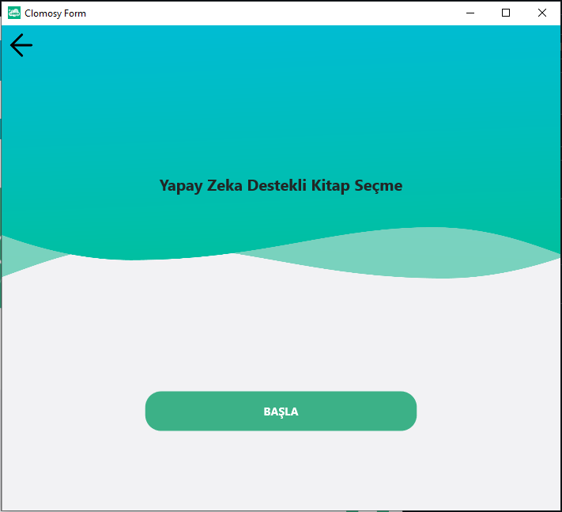
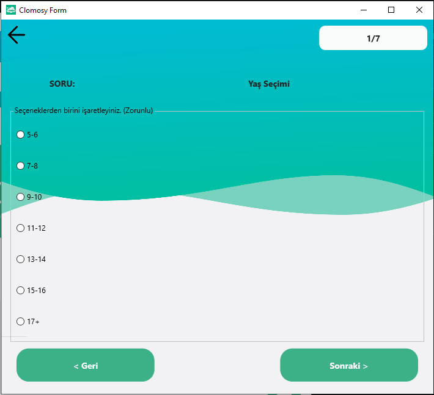
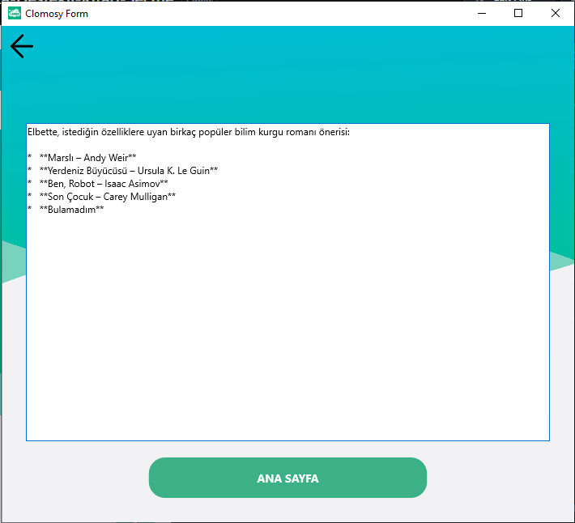

# Yapay Zeka Destekli Kitap Seçme

Bu uygulama, kitap okuma alışkanlıklarınız ve tercihleriniz doğrultusunda doldurduğunuz anket sonuçlarını yapay zeka ile analiz ederek size özel kitap önerilerinde bulunan bir uygulamadır.

## Nedir?

Yaş, kitap türü ve okuma formatı gibi kriterleri göz önünde bulundurarak en uygun kitapları önermek amacıyla geliştirilmiştir. Anket süresince kullanıcıdan birkaç kısa soruya yanıt vermesi istenir. Verilen cevaplar yapay zeka tarafından analiz edilerek kişiye özel kitap önerileri sunulur.

## Özellikler

- Basit ve anlaşılır kullanıcı arayüzü
- Adım adım ilerleyen soru sistemi
- Kitap önerileri, anket cevaplarınız doğrultusunda yapay zeka tarafından gerçek zamanlı olarak oluşturulur.
- Hızlı ve interaktif deneyim

## Nasıl Kullanılır?

1. Uygulama açıldığında 'BAŞLA' butonu ile ankete başlanır. 
2. Her soruya uygun bir yanıt seçin ve "İleri" butonuna tıklayın.
3. Son soruya kadar bu adımları tekrarlayın.
4. Anket tamamlandığında sistem size en uygun kitap önerilerini otomatik olarak getirir.

